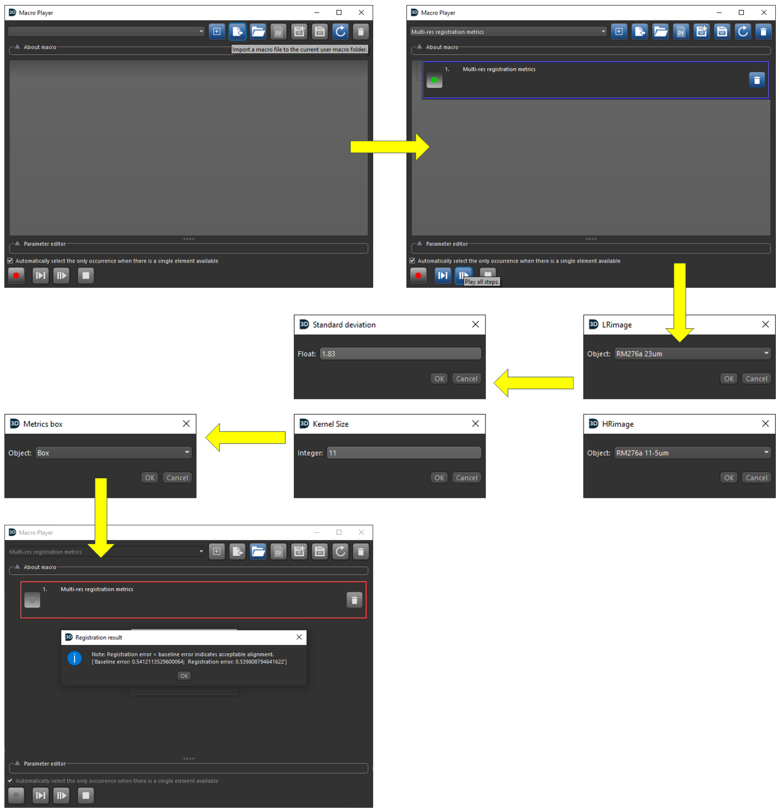

# Multi-resolution Image Registration Metrics

This repository accompanies the paper by Jia *et al.*, “Advancing X-ray microcomputed tomography image processing of avian eggshells: An improved registration metric for multiscale 3D images and resolution-enhanced segmentation of eggshell pores using edge-attentive neural networks.”

It provides a [Dragonfly 3D World](https://www.theobjects.com/dragonfly/) macro for evaluating the alignment of registered low-resolution (LR) and high-resolution (HR) grayscale image channels within a user-defined region. The metric is based on local grayscale-gradient edges, as described in the paper.

## Method overview

The macro:

1. asks for an LR image channel and an HR image channel;
2. applies edge filtering to both channels;
3. applies a user-configured Gaussian filter to the HR channel, then samples it at twice its voxel spacing to produce an artificial low-resolution channel (`aLR image`);
4. restricts the comparison to a selected visual shape (`Metrics box`);
5. uses Otsu thresholding to obtain edge regions of interest (ROIs);
6. compares the LR and artificial-LR edge ROIs with the HR edge ROI; and
7. reports a **Registration error** and a **Baseline error**.

The result dialog states that a registration error below the baseline error indicates acceptable alignment.

## Requirements

- [Dragonfly 3D World](https://www.theobjects.com/dragonfly/)
- Created/tested with Dragonfly 3D World **2024.1.0.1613**.

Eligible academic users may obtain a free, non-commercial licence under Dragonfly’s [FreeD licensing programme](https://www.theobjects.com/dragonfly/publications-how-to-cite-dragonfly.html), subject to its eligibility criteria and terms.

## Install the macro

The macro is the complete file:

[`Macro/Registrationmetricsv5_0b8f831a222011f0a7a6b07b25210968.py`](Macro/Registrationmetricsv5_0b8f831a222011f0a7a6b07b25210968.py)

Download or clone the repository, then copy or load **this entire file unchanged**. Do not copy only selected Python sections: the file contains Dragonfly macro metadata and recorded macro definitions in addition to executable Python.

In Dragonfly 2024.1:

1. Open **Utilities > Macro Player**.
2. Select **Import Macro** and choose the complete `.py` file above. Dragonfly copies it to the current user’s macro folder.
3. Select **Multi-res registration metrics** in the Macro Player.

Menu names can differ between Dragonfly versions. See the official [Dragonfly 2024.1 macro documentation](https://www.theobjects.com/dragonfly/dfhelp/2024-1/Content/Macros/Recording%20and%20Playing%20Macros.htm) for Macro Player controls and macro locations.

## Usage

Before running the macro, load the registered LR and HR grayscale image channels into the Dragonfly workspace and create a visual box covering the region to evaluate. The selected channels and box should describe the same physical region.

1. In the Macro Player, choose **Play All**.
2. Select the LR channel when prompted for `LRimage`.
3. Select the HR channel when prompted for `HRimage`.
4. Enter the **Standard deviation** and **Kernel Size** for the Gaussian filter applied before the artificial low-resolution image is sampled. These settings should reflect the scale relationship being evaluated.
5. Select the visual box when prompted for `Metrics box`.
6. Read the **Registration result** dialog.

The macro publishes intermediate channels and ROIs in the Dragonfly workspace, including:

- `aLR image`
- `LR edge extract`, `HR edge extract`, and `aLR edge extract`
- `LR edge ROI`, `HR edge ROI`, and `aLR edge ROI`
- `LRedge-HRedge` and `aLRedge-HRedge`

The final dialog reports the registration and baseline errors and provides the macro’s comparison criterion.



## Repository contents

```text
.
├── Macro/
│   └── Registrationmetricsv5_0b8f831a222011f0a7a6b07b25210968.py
├── Instruction.png
├── LICENSE
└── README.md
```

## Citation

Jia, S., Piché, N., McKee, M. D., & Reznikov, N. (2025). Advancing X-ray microcomputed tomography image processing of avian eggshells: An improved registration metric for multiscale 3D images and resolution-enhanced segmentation of eggshell pores using edge-attentive neural networks. *Micron, 199*, 103915. [https://doi.org/10.1016/j.micron.2025.103915](https://doi.org/10.1016/j.micron.2025.103915)

## Licence and support

The repository is distributed under the [MIT License](LICENSE).

For repository-specific questions or reproducible problems, open a [GitHub issue](https://github.com/ShumengJ/Multi-resolution-ImageRegistrationMetrics/issues); for broader Dragonfly questions, ask the community on [Dragonfly Social](https://dragonfly.comet.tech/en/company/dragonfly-social).
